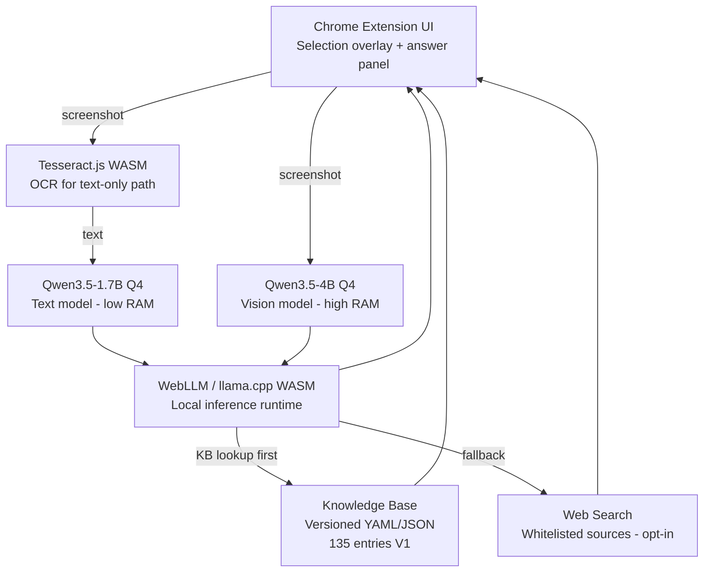
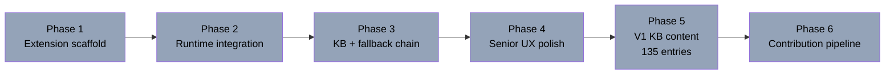

# Senior Assist — Project Dashboard

## Architecture

*Updated when architecture changes. Not on every edit.*

## Plan Progress

*Mirrors current implementation plan. Updated as phases complete.*

## Session Log

| Date | Summary | Next |
|------|---------|------|
| 2026-03-06 | Brainstorm: pivoted from Android launcher → fraud prevention → tech literacy Chrome extension. Design approved. | Write implementation plan |

## Where I Left Off

Design doc approved. Project scaffolded at `~/src/senior-assist`. Next: implementation plan via writing-plans skill.
