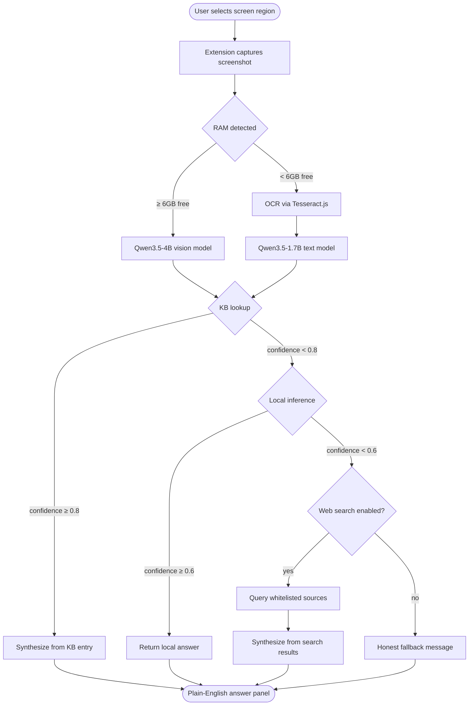

# Senior Assist — Design Document

**Date:** 2026-03-06
**Status:** Approved
**Session:** Brainstormed from nexus/claude/senior-tech-safety-research-s06mj

---

## Problem

Seniors (60+) face a widening digital literacy gap. Interfaces change constantly, models lag behind, and existing AI assistants assume users can prompt well. Fraud prevention was the original goal but was ruled out: 1-3B models lack the recall and pattern-matching depth needed for consistent fraud detection, and the failure mode (confident wrong answer) is unacceptable. Tech literacy errors are recoverable — a senior gets a slightly outdated answer about where Gmail's settings moved, and they correct it themselves. That's an acceptable failure mode.

**The real problem:** No privacy-preserving, local-first, senior-oriented tech help layer exists. Google's Gemini Nano is the closest analog — Pixel-only, not open source, not positioned as a literacy tool.

---

## Goal

A Chrome extension that answers "what is this?" for anything on screen, running entirely on-device, in plain English, with no data leaving the machine. Open source, community-maintained knowledge base.

---

## Non-Goals (V1)

- Fraud detection or scam prevention
- iOS / Safari support
- Mobile app
- Android launcher
- Voice interface
- Fine-tuned model training
- Subscription or monetization

---

## Architecture



### Three-layer stack

```
┌─────────────────────────────────────┐
│         Chrome Extension (UI)        │
│  Selection overlay → "What is this?"│
│  Plain-English answer panel          │
└──────────────┬──────────────────────┘
               │
┌──────────────▼──────────────────────┐
│         Reasoning Layer              │
│  Qwen3.5-1.7B (text, <6GB RAM)      │
│  Qwen3.5-4B   (vision, ≥6GB RAM)    │
│  WebLLM / llama.cpp WASM runtime    │
└──────────────┬──────────────────────┘
               │
┌──────────────▼──────────────────────┐
│         Knowledge Base (JSON)        │
│  Versioned, structured, curated      │
│  Community-maintained via web form   │
└─────────────────────────────────────┘
```

---

## Model Selection

| RAM detected | Model loaded | Modality | Notes |
|-------------|-------------|----------|-------|
| < 6GB free  | Qwen3.5-1.7B (Q4) | Text only | Screenshot → OCR → text input |
| ≥ 6GB free  | Qwen3.5-4B (Q4)   | Vision   | Screenshot passed directly |

Hardware detection runs at extension install. Model downloaded once, cached locally. No re-download unless user updates.

---

## Knowledge Base

### Format

```yaml
# kb/gmail-web.yaml
app: Gmail
platform: web
entry_id: gmail-001
element: Archive button
selectors: ["[aria-label='Archive']", "[data-tooltip='Archive']"]
versions_covered: "2022-present"
plain_english: >
  This moves the email out of your inbox without deleting it.
  You can still find it by searching, or in the "All Mail" folder.
  It does NOT delete the email.
related_confusion:
  - "different from Delete"
  - "where did the email go"
last_verified: "2026-01"
contributed_by: "maintainer"
```

### V1 scope (135 entries across 8 apps)

| App | Entries |
|-----|---------|
| Gmail / Outlook | 25 |
| Facebook | 20 |
| Chrome / Edge browser UI | 20 |
| Windows 11 | 20 |
| macOS | 15 |
| YouTube | 10 |
| WhatsApp / iMessage | 10 |
| General web (cookie banners, HTTPS warnings, notification popups) | 15 |

**Effort:** ~45 person-hours at 20 min/entry. Achievable as pre-launch solo sprint.

### Contribution mechanic

- **Web form** → generates GitHub PR automatically (low barrier, no git knowledge required)
- **Direct YAML PR** for developers
- **GitHub Issues** for staleness reports ("Gmail moved this button")
- No ML knowledge required to contribute

---

## Extension UX

1. User clicks extension icon or uses keyboard shortcut
2. Screen dims slightly, crosshair cursor appears
3. User drags to select region (or clicks a single element)
4. Loading indicator (≤3 seconds target for KB hit)
5. Plain-English answer appears in a non-blocking panel (bottom-right)
6. Panel includes: answer text, confidence indicator, "Was this helpful? Yes / No", "Search online instead" link

**Senior UX principles applied:**
- No jargon in UI copy
- Large text (16px minimum)
- Single interaction to trigger (no multi-step flows)
- Failure states give a safe next step, not an error code
- No persistent data collection, no account required

---

## Tech Stack

| Layer | Choice | Reason |
|-------|--------|--------|
| Extension | Chrome MV3 (Firefox-compatible) | Broadest reach; MV3 required for new Chrome extensions |
| Runtime | WebLLM (primary) + llama.cpp WASM (fallback) | WebLLM has best WebGPU support; WASM fallback for CPU-only machines |
| Models | Qwen3.5-1.7B / 4B Q4 GGUF | Smallest viable with multimodal; released 2026-03 |
| KB format | YAML (source) → JSON (distributed) | YAML is human-editable; JSON is fast to parse at runtime |
| OCR (text-only path) | Tesseract.js WASM | No network required, runs in extension worker |
| Web search (optional) | Bing Search API or SerpAPI | Free tier sufficient for low-volume fallback |
| Build | Vite + vanilla JS | Keep bundle small; no heavy framework needed |

---

## Open Source Positioning

**Pitch:** *"Ask your computer anything. It answers privately, on your machine, in plain English."*

**Differentiators:**
- Privacy-first: no cloud inference by default
- No subscription, no account
- Designed for seniors, not assumed to be developers
- KB contributions don't require ML knowledge
- Versioned KB means the tool stays current independent of model retraining

**License:** MIT for extension code. CC-BY-4.0 for knowledge base content.

---

## Risks & Mitigations

| Risk | Mitigation |
|------|-----------|
| Model gives outdated UI answer | KB is primary source; model synthesizes, doesn't recall |
| KB falls behind app updates | GitHub Issues as staleness signal; web form lowers contributor bar |
| WebGPU not available (older hardware) | WASM CPU fallback; graceful degradation |
| Seniors can't install extension | One-click install guide; family setup flow in docs |
| Confidence calibration on small models | Explicit fallback chain; honest "I'm not sure" always available |
| Chrome MV3 review delays | Firefox as parallel distribution channel |

---

## Success Criteria (V1)

- Extension installs and loads model in < 60 seconds on 8GB machine
- "What is this?" flow completes in ≤ 5 seconds (KB hit) or ≤ 10 seconds (local inference)
- 135 KB entries ship at launch covering 8 app categories
- Answer quality validated by non-technical testers (family members of seniors)
- GitHub Issues open for community contributions at launch
