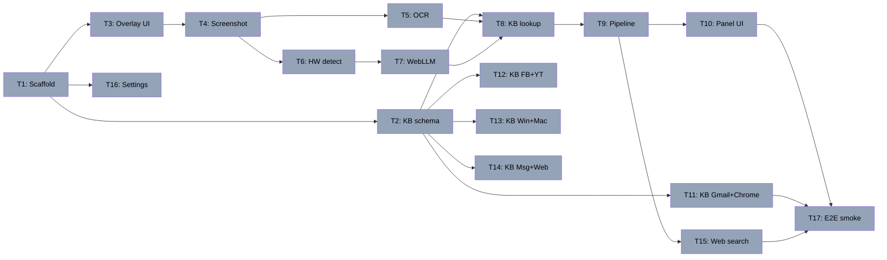

# Senior Assist Implementation Plan

> **For Claude:** REQUIRED SUB-SKILL: Use superpowers:executing-plans to implement this plan task-by-task.

**Goal:** Chrome MV3 extension — "what is this?" answered locally by Qwen3.5 backed by a versioned community KB.

**Architecture:** Selection overlay captures screenshot → OCR (Tesseract.js) or vision model (Qwen3.5-4B) by RAM → KB lookup → local inference → optional web search → honest fallback → plain-English answer panel.

**Tech Stack:** Chrome MV3, Vite + crxjs, vanilla JS, WebLLM, Tesseract.js WASM, YAML→JSON KB, Qwen3.5-1.7B/4B Q4, Vitest

---



## Parallelization Map

| Wave | Tasks | Why parallel |
|------|-------|-------------|
| 1 | T1 | Foundation — everything depends on it |
| 2 | T2, T3, T16 | No shared files |
| 3 | T4, T11, T12, T13, T14 | T4 needs T3; KB content only needs T2 schema |
| 4 | T5, T6 | Both need T4; different files |
| 5 | T7, T8 | T7 needs T6; T8 needs T5+T2; no overlap |
| 6 | T9 | Integrates T7+T8 |
| 7 | T10, T15 | Both need T9; different files |
| 8 | T17 | Needs everything above |

---

## Task 1: Project scaffold

**Files:** `manifest.json`, `vite.config.js`, `package.json`, `src/background.js`, `src/content.js`, `src/popup.html`, `src/popup.js`, `.gitignore`

**Step 1: Init and install**
```bash
cd ~/src/senior-assist
npm init -y
npm install --save-dev vite @crxjs/vite-plugin vitest
npm install @mlc-ai/web-llm tesseract.js js-yaml
```

**Step 2: Create `manifest.json`**
```json
{
  "manifest_version": 3,
  "name": "Senior Assist",
  "version": "0.1.0",
  "description": "Ask your computer anything. It answers privately, in plain English.",
  "permissions": ["activeTab", "scripting", "storage"],
  "host_permissions": ["<all_urls>"],
  "background": { "service_worker": "src/background.js", "type": "module" },
  "content_scripts": [{ "matches": ["<all_urls>"], "js": ["src/content.js"] }],
  "action": { "default_popup": "src/popup.html" },
  "options_page": "src/settings.html"
}
```

**Step 3: Create `vite.config.js`**
```js
import { defineConfig } from 'vite'
import { crx } from '@crxjs/vite-plugin'
import manifest from './manifest.json'
export default defineConfig({ plugins: [crx({ manifest })], build: { target: 'esnext' } })
```

**Step 4: Add scripts to `package.json`**
```json
"scripts": { "build": "vite build", "dev": "vite build --watch", "test": "vitest run" }
```

**Step 5: Create stubs**

`src/background.js`: `console.log('Senior Assist background started')`
`src/content.js`: `console.log('Senior Assist content loaded')`
`src/popup.html`: minimal HTML with `<p id="status">Ready.</p>`
`src/popup.js`: `document.getElementById('status').textContent = 'Ready. Click the icon on any page.'`

**Step 6: Verify build**
```bash
npm run build 2>&1 | tail -5
```
Expected: `dist/` created, no errors.

**Step 7: Commit**
```bash
git add -A && git commit -m "feat: Chrome MV3 scaffold with Vite + crxjs"
```

---

## Task 2: KB schema + loader

**Files:** `kb/schema.js`, `kb/index.js`, `kb/gmail-web.yaml` (sample), `tests/kb.test.js`

**Step 1: Write failing test**
```js
// tests/kb.test.js
import { describe, it, expect } from 'vitest'
import { loadKB, findEntry } from '../kb/index.js'

describe('KB loader', () => {
  it('loads entries', async () => {
    const kb = await loadKB()
    expect(kb.length).toBeGreaterThan(0)
  })
  it('finds entry by element name', async () => {
    const kb = await loadKB()
    const e = findEntry(kb, { ocrText: 'Archive' })
    expect(e?.entry_id).toBe('gmail-001')
  })
  it('returns null on no match', async () => {
    const kb = await loadKB()
    expect(findEntry(kb, { ocrText: 'xyzzy' })).toBeNull()
  })
  it('all entries have required fields', async () => {
    const kb = await loadKB()
    for (const e of kb) {
      expect(e.entry_id).toBeTruthy()
      expect(e.plain_english).toBeTruthy()
      expect(e.last_verified).toBeTruthy()
    }
  })
})
```

**Step 2: Run — confirm FAIL**
```bash
npx vitest run tests/kb.test.js 2>&1 | tail -5
```

**Step 3: Create sample `kb/gmail-web.yaml`**
```yaml
- app: Gmail
  platform: web
  entry_id: gmail-001
  element: Archive button
  selectors: ["[aria-label='Archive']"]
  versions_covered: "2022-present"
  plain_english: >
    This moves the email out of your inbox without deleting it.
    You can find it again by searching or in "All Mail". It does NOT delete the email.
  related_confusion: [different from Delete, where did the email go]
  last_verified: "2026-01"
  contributed_by: maintainer
```

**Step 4: Create `kb/schema.js`**
```js
export const REQUIRED = ['entry_id', 'app', 'plain_english', 'last_verified']
export function validate(e) {
  for (const f of REQUIRED) if (!e[f]) throw new Error(`KB entry missing: ${f}`)
}
```

**Step 5: Create `kb/index.js`**
```js
import yaml from 'js-yaml'
import { validate } from './schema.js'
let _cache = null
export async function loadKB() {
  if (_cache) return _cache
  const mods = import.meta.glob('./*.yaml', { as: 'raw', eager: true })
  const entries = []
  for (const [, raw] of Object.entries(mods)) {
    const parsed = yaml.load(raw)
    for (const e of (Array.isArray(parsed) ? parsed : [parsed])) {
      validate(e); entries.push(e)
    }
  }
  return (_cache = entries)
}
export function findEntry(kb, { ocrText }) {
  if (!ocrText) return null
  const lower = ocrText.toLowerCase()
  return kb.find(e => e.element && lower.includes(e.element.toLowerCase())) ?? null
}
```

**Step 6: Run — confirm PASS**
```bash
npx vitest run tests/kb.test.js 2>&1 | tail -5
```

**Step 7: Commit**
```bash
git add kb/ tests/kb.test.js && git commit -m "feat: KB schema, YAML loader, findEntry with tests"
```

---

## Task 3: Selection overlay UI

**Files:** `src/overlay.js`, `src/overlay.css`, `src/content.js` (modify), `tests/overlay.test.js`

**Step 1: Write failing test**
```js
// tests/overlay.test.js
import { describe, it, expect, afterEach } from 'vitest'
import { setupOverlay, teardownOverlay, getSelection } from '../src/overlay.js'
afterEach(() => teardownOverlay())
describe('Overlay', () => {
  it('injects overlay into DOM', () => {
    setupOverlay(() => {})
    expect(document.getElementById('sa-overlay')).toBeTruthy()
  })
  it('removes on teardown', () => {
    setupOverlay(() => {}); teardownOverlay()
    expect(document.getElementById('sa-overlay')).toBeNull()
  })
  it('getSelection is null before drag', () => {
    setupOverlay(() => {})
    expect(getSelection()).toBeNull()
  })
})
```

**Step 2: Run — confirm FAIL**

**Step 3: Create `src/overlay.css`**
```css
#sa-overlay { position:fixed; inset:0; background:rgba(0,0,0,.35); z-index:2147483647; cursor:crosshair; }
#sa-selection-box { position:fixed; border:2px solid #3b82f6; background:rgba(59,130,246,.15); pointer-events:none; z-index:2147483647; }
```

**Step 4: Create `src/overlay.js`**
```js
let _overlay=null,_box=null,_sx=0,_sy=0,_sel=null,_cb=null
export function setupOverlay(cb) {
  _cb=cb; _sel=null
  _overlay=Object.assign(document.createElement('div'),{id:'sa-overlay'})
  _box=Object.assign(document.createElement('div'),{id:'sa-selection-box'})
  document.body.append(_overlay,_box)
  _overlay.addEventListener('mousedown',_down)
}
export function teardownOverlay() {
  _overlay?.removeEventListener('mousedown',_down)
  _overlay?.remove(); _box?.remove(); _overlay=_box=null
}
export const getSelection = () => _sel
function _down(e) { _sx=e.clientX; _sy=e.clientY; document.addEventListener('mousemove',_move); document.addEventListener('mouseup',_up) }
function _move(e) { const [x,y,w,h]=[Math.min(e.clientX,_sx),Math.min(e.clientY,_sy),Math.abs(e.clientX-_sx),Math.abs(e.clientY-_sy)]; Object.assign(_box.style,{left:x+'px',top:y+'px',width:w+'px',height:h+'px'}) }
function _up(e) {
  document.removeEventListener('mousemove',_move); document.removeEventListener('mouseup',_up)
  _sel={x:Math.min(e.clientX,_sx),y:Math.min(e.clientY,_sy),width:Math.abs(e.clientX-_sx),height:Math.abs(e.clientY-_sy)}
  teardownOverlay()
  if(_sel.width>5&&_sel.height>5) _cb(_sel)
}
```

**Step 5: Update `src/content.js`**
```js
import { setupOverlay } from './overlay.js'
chrome.runtime.onMessage.addListener((msg) => {
  if (msg.type==='START_SELECTION') setupOverlay(sel => chrome.runtime.sendMessage({type:'SELECTION_COMPLETE',sel}))
})
```

**Step 6: Run — confirm PASS**
```bash
npx vitest run tests/overlay.test.js --environment jsdom 2>&1 | tail -5
```

**Step 7: Commit**
```bash
git add src/overlay.js src/overlay.css src/content.js tests/overlay.test.js && git commit -m "feat: drag-to-select screen overlay"
```

---

## Task 4: Screenshot capture

**Files:** `src/screenshot.js`, `tests/screenshot.test.js`

**Step 1: Failing test**
```js
// tests/screenshot.test.js
import { describe, it, expect, vi } from 'vitest'
import { captureRegion } from '../src/screenshot.js'
describe('Screenshot', () => {
  it('rejects zero-area selection', async () => {
    await expect(captureRegion({x:0,y:0,width:0,height:5})).rejects.toThrow('Invalid')
  })
  it('returns data URL', async () => {
    global.chrome = { tabs: { captureVisibleTab: vi.fn((_,__,cb)=>cb('data:image/png;base64,abc')) }, runtime: { lastError: null } }
    global.window = { devicePixelRatio: 1 }
    // OffscreenCanvas not available in test — just verify the chrome API is called
    vi.spyOn(global.chrome.tabs,'captureVisibleTab')
    try { await captureRegion({x:10,y:10,width:100,height:80}) } catch(_) {}
    expect(chrome.tabs.captureVisibleTab).toHaveBeenCalled()
  })
})
```

**Step 2: Create `src/screenshot.js`**
```js
export async function captureRegion(sel) {
  if (!sel.width||!sel.height) throw new Error('Invalid selection')
  const dataUrl = await new Promise((res,rej) =>
    chrome.tabs.captureVisibleTab(null,{format:'png'},url => chrome.runtime.lastError ? rej(new Error(chrome.runtime.lastError.message)) : res(url))
  )
  const img = await new Promise((res,rej)=>{ const i=new Image(); i.onload=()=>res(i); i.onerror=rej; i.src=dataUrl })
  const dpr = window.devicePixelRatio||1
  const canvas = new OffscreenCanvas(Math.round(sel.width*dpr),Math.round(sel.height*dpr))
  const ctx = canvas.getContext('2d')
  ctx.drawImage(img,sel.x*dpr,sel.y*dpr,sel.width*dpr,sel.height*dpr,0,0,canvas.width,canvas.height)
  const blob = await canvas.convertToBlob({type:'image/png'})
  return new Promise(res=>{ const r=new FileReader(); r.onloadend=()=>res(r.result); r.readAsDataURL(blob) })
}
```

**Step 3: Run + commit**
```bash
npx vitest run tests/screenshot.test.js 2>&1 | tail -5
git add src/screenshot.js tests/screenshot.test.js && git commit -m "feat: screenshot capture with region crop"
```

---

## Task 5: OCR | Task 6: Hardware detection | Task 7: WebLLM runtime

> These three tasks follow the same TDD pattern. Full code below.

### Task 5 — `src/ocr.js`
```js
import Tesseract from 'tesseract.js'
export async function extractText(dataUrl) {
  const r = await Tesseract.recognize(dataUrl,'eng')
  return r.data.text.trim()
}
```
Test: mock `tesseract.js`, assert returns string. Commit: `"feat: OCR via Tesseract.js WASM"`

### Task 6 — `src/hardware.js`
```js
const MODELS = { vision:'Qwen3.5-4B-q4f16_1-MLC', text:'Qwen3.5-1.7B-q4f16_1-MLC' }
export async function detectHardware() {
  const memGB = navigator.deviceMemory??4
  const webgpu = typeof navigator.gpu!=='undefined'
  const tier = (memGB>=6&&webgpu)?'vision':'text'
  return { memGB, webgpu, modelTier:tier, modelId:MODELS[tier] }
}
```
Test: mock `navigator.deviceMemory`, assert correct tier. Commit: `"feat: hardware detection for model tier"`

### Task 7 — `src/runtime.js`
```js
import { CreateMLCEngine } from '@mlc-ai/web-llm'
let _engine=null, _modelId=null
export async function loadModel(modelId,onProgress) {
  if(_modelId===modelId) return
  _engine = await CreateMLCEngine(modelId,{initProgressCallback:onProgress??()=>{}})
  _modelId=modelId
}
export async function query({ocrText,imageB64,kbEntry}) {
  if(!_engine) throw new Error('Model not loaded')
  const ctx = kbEntry?`Reference: ${kbEntry.plain_english}`:''
  const userMsg = imageB64
    ? [{type:'image_url',image_url:{url:`data:image/png;base64,${imageB64}`}},{type:'text',text:'What is this? Explain in plain English for a senior.'}]
    : `Screen text: "${ocrText}". What is this? Plain English, 2-3 sentences max. ${ctx}`
  const r = await _engine.chat.completions.create({
    messages:[{role:'system',content:'You help seniors understand their computer screen. Plain English only. Be brief and reassuring.'},{role:'user',content:userMsg}],
    max_tokens:150, temperature:0.3
  })
  return r.choices[0].message.content.trim()
}
```
Test: mock `@mlc-ai/web-llm`, assert answer string returned. Commit: `"feat: WebLLM runtime with senior-tuned system prompt"`

---

## Task 8: KB lookup with confidence

**Files:** `src/lookup.js`, `tests/lookup.test.js`

```js
// src/lookup.js
export function lookupWithConfidence(kb,{ocrText}) {
  if(!ocrText) return {entry:null,confidence:0}
  const lower=ocrText.toLowerCase()
  let best=null,score=0
  for(const e of kb) {
    let s=0
    if(e.element&&lower.includes(e.element.toLowerCase())) s=Math.max(s,0.9)
    for(const t of (e.related_confusion??[])) if(lower.includes(t.toLowerCase())) s=Math.max(s,0.6)
    if(s>score){score=s;best=e}
  }
  return {entry:score>0?best:null,confidence:score}
}
```

Test: exact match → confidence ≥ 0.8; no match → 0; confusion term match → > 0.
Commit: `"feat: KB lookup with confidence scoring"`

---

## Task 9: Fallback pipeline

**Files:** `src/pipeline.js`, `tests/pipeline.test.js`

```js
// src/pipeline.js
import { lookupWithConfidence } from './lookup.js'
const FALLBACK = "I'm not sure what that is. Try clicking it once, or press Escape to cancel."
export async function runPipeline({kb,ocrText,imageB64,query,webSearchEnabled}) {
  const {entry,confidence} = lookupWithConfidence(kb,{ocrText})
  if(confidence>=0.8) return {source:'kb',answer:entry.plain_english,entry,confidence}
  try {
    const answer = await query({ocrText,imageB64,kbEntry:entry})
    if(answer) return {source:'model',answer,entry,confidence}
  } catch(_){}
  if(webSearchEnabled) {
    try {
      const {searchAndSynthesize} = await import('./search.js')
      const a = await searchAndSynthesize(ocrText,query)
      if(a) return {source:'search',answer:a,entry:null,confidence:0.5}
    } catch(_){}
  }
  return {source:'fallback',answer:FALLBACK,entry:null,confidence:0}
}
```

Test: high-confidence KB → no model call; low-confidence → model called; model throws → fallback.
Commit: `"feat: confidence-gated fallback pipeline"`

---

## Task 10: Answer panel UI

**Files:** `src/panel.js`, `src/panel.css`, `tests/panel.test.js`

Panel: fixed bottom-right, dark background, 16px+ font, answer text, source label, "Helpful ✓" / "Not helpful" buttons, close button. Feedback stored in `localStorage` (max 100 entries, never leaves device).

Test: injects `#sa-panel`; hidePanel removes it; source indicator present.
Commit: `"feat: answer panel with senior-friendly styling and feedback"`

---

## Tasks 11–14: V1 KB Content

Each task authors YAML + a validation test.

| Task | Files | Apps | Entries | Test assertion |
|------|-------|------|---------|----------------|
| T11 | `kb/gmail-web.yaml`, `kb/chrome-browser.yaml` | Gmail, Outlook, Chrome, Edge | 45 | ≥ 40 entries for these apps |
| T12 | `kb/facebook-web.yaml`, `kb/youtube-web.yaml` | Facebook, YouTube | 30 | ≥ 25 entries |
| T13 | `kb/windows11.yaml`, `kb/macos.yaml` | Windows, macOS | 35 | ≥ 30 entries |
| T14 | `kb/messaging.yaml`, `kb/general-web.yaml` | WhatsApp/iMessage, General web | 25 | ≥ 20 entries |

Each task commits: `"content: <apps> KB entries"`

**Key elements to cover per app:**

- **Gmail/Outlook:** Archive, Delete, Spam, Reply All, Forward, Compose, Labels, Search bar, Settings gear, Undo Send, Starred, Drafts, Sent, All Mail, Promotions tab, Attachment icon, Snooze, Schedule Send, Mark Read, Block sender
- **Chrome/Edge:** URL bar, Bookmark star, Extensions icon, Incognito, Downloads, "Not secure", Cookie banner, Allow notifications popup, Password save prompt, Autofill, Tab pin, Reload, Back/Forward, Zoom, Print dialog, Update prompt, Safe Browsing warning
- **Facebook:** News Feed, Like, Share, Comment, Friends list, Marketplace, Groups, Events, Privacy settings, Who can see posts, Block, Unfriend vs Unfollow, Story vs Post, Notifications, Messenger, Sponsored badge, Report post
- **YouTube:** Subscribe, Notification bell, Like/Dislike, Share, Save to playlist, Autoplay toggle, Captions/CC, Quality settings, Ad skip button
- **Windows 11:** Start menu, Taskbar, System tray, Action Center, Windows Update, OneDrive icon, Defender notification, File Explorer, Recycle Bin, Snap layouts, Task Manager, Settings vs Control Panel, Battery/WiFi/Bluetooth icons
- **macOS:** Dock, Finder, Spotlight, Menu bar, Apple menu, App Store badge, iCloud prompt, Time Machine, Mission Control, AirDrop, System Settings, Notification Center, Gatekeeper warning
- **Messaging:** Read receipts, Group chat, Block/report, Voice vs video call, WhatsApp Web QR, Forwarded label, iMessage vs SMS bubble colors, Tapback reactions
- **General web:** Cookie consent, Allow notifications popup, HTTPS padlock, "Not secure", Password manager popup, Browser update, Captcha, Location request, PDF download, 404 error, Session timeout, "Remember me", 2FA SMS prompt

---

## Task 15: Web search fallback

**Files:** `src/search.js`, `tests/search.test.js`, `src/pipeline.js` (already wired via dynamic import in T9)

```js
// src/search.js
const TRUSTED = ['support.google.com','support.microsoft.com','support.apple.com','howtogeek.com','aarp.org','support.facebook.com','help.youtube.com']
export async function searchAndSynthesize(ocrText,query) {
  if(!ocrText) return null
  const key = await new Promise(r=>chrome.storage.local.get('bingApiKey',d=>r(d.bingApiKey??null)))
  if(!key) return null
  const q = `${ocrText} (${TRUSTED.map(s=>`site:${s}`).join(' OR ')})`
  const r = await fetch(`https://api.bing.microsoft.com/v7.0/search?q=${encodeURIComponent(q)}&count=3`,{headers:{'Ocp-Apim-Subscription-Key':key}})
  if(!r.ok) return null
  const data = await r.json()
  const snippets = (data.webPages?.value??[]).map(v=>v.snippet).join('\n')
  if(!snippets) return null
  return query({ocrText,imageB64:null,kbEntry:null,searchContext:snippets})
}
```

Test: mock fetch + query function, assert string returned; empty ocrText → null.
Commit: `"feat: opt-in web search fallback via whitelisted sources"`

---

## Task 16: Settings page

**Files:** `src/settings.html`, `src/settings.js`

Simple form: "Enable web search" toggle + Bing API key text input + Save button. Reads/writes `chrome.storage.local`. Large text, plain English labels.

Commit: `"feat: settings page with web search toggle"`

---

## Task 17: E2E smoke test

**Files:** `tests/e2e/smoke.test.js`

```js
// tests/e2e/smoke.test.js
import { describe, it, expect, vi } from 'vitest'
import { loadKB } from '../../kb/index.js'
import { runPipeline } from '../../src/pipeline.js'

describe('E2E smoke', () => {
  it('returns KB answer for known Gmail element', async () => {
    const kb = await loadKB()
    const query = vi.fn()
    const r = await runPipeline({kb,ocrText:'Archive',imageB64:null,query,webSearchEnabled:false})
    expect(r.source).toBe('kb')
    expect(r.answer.length).toBeGreaterThan(10)
    expect(query).not.toHaveBeenCalled()
  })
  it('KB has 135+ entries', async () => {
    const kb = await loadKB()
    expect(kb.length).toBeGreaterThanOrEqual(135)
  })
  it('all 6 core app families represented', async () => {
    const kb = await loadKB()
    const apps = new Set(kb.map(e=>e.app))
    for (const a of ['Gmail','Chrome','Facebook','YouTube','Windows','macOS']) {
      expect([...apps].some(x=>x.includes(a)),`Missing: ${a}`).toBe(true)
    }
  })
})
```

**Final verification:**
```bash
npx vitest run          # all tests passing
npm run build           # dist/ builds clean
# Load dist/ as unpacked extension in chrome://extensions
# Navigate to Gmail → trigger selection → draw box around Archive button
# Confirm answer panel appears within 5s with plain English text
```

Commit: `"test: E2E smoke — pipeline + KB coverage"`

```bash
git push origin main
```
